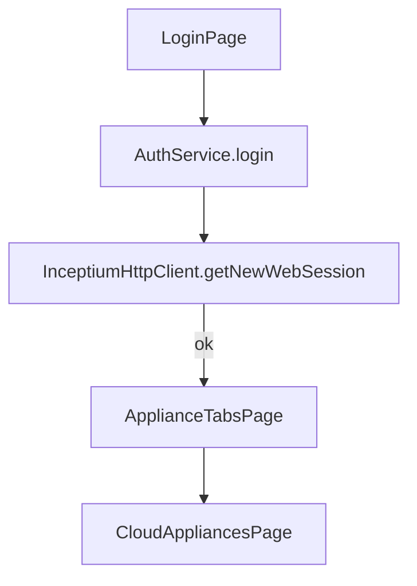
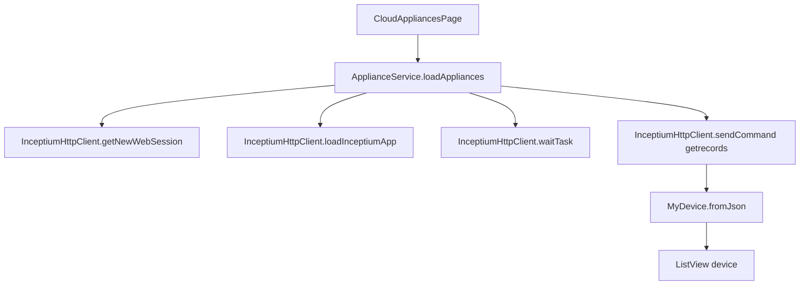
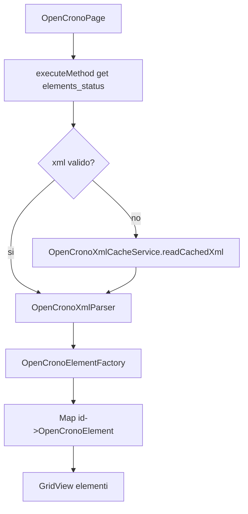
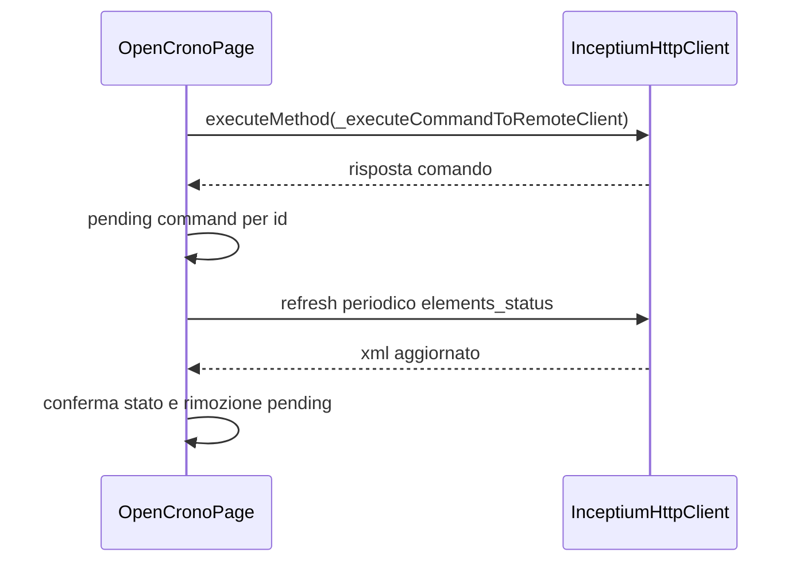

# OpenCrono - Architettura Tecnica

## 1) Struttura reale delle cartelle

```text
lib/
  main.dart
  app.dart
  core/
    config/
    inceptium/
      events/
      models/
      services/
    services/
    utils/
  features/
    auth/
      models/
      pages/
      services/
    appliances/
      models/
      pages/
      services/
    opencrono/
      models/
      pages/
      services/
      widgets/
  opencrono/
    factory/
    models/elements/
    resources/
  shared/
    theme/
    widgets/
```

## 2) Responsabilita per cartella

### core/config
- app_config.dart: metadati app e baseUrl placeholder.
- inceptium_config.dart: configurazione statica legacy per endpoint Inceptium.

### core/inceptium
Layer Inceptium principale usato nel flusso app.
- models/inceptium_config.dart: configurazione endpoint tipizzata e istanza myshelter.
- models/inceptium_credentials.dart: credenziali con validazione.
- models/inceptium_connection_status.dart: enum stato connessione.
- events/inceptium_event.dart: eventi runtime (statusChanged, commandSent, error, ecc.).
- services/inceptium_http_client.dart: client HTTP completo (sessione, comandi, load app, wait task, executeMethod).

### core/services
- inceptium_http_client.dart: client semplificato orientato solo apertura sessione.
- inceptium_auth_service.dart: mock/minimal auth service.

Nota: il flusso runtime principale usa core/inceptium/services/inceptium_http_client.dart.

### core/utils
- app_log.dart: logger centralizzato (metodi d/e/w).
- validators.dart: helper validazione email/password.

### features/auth
- pages/login_page.dart: UI login, gestione stato loading/error, navigazione a tab appliance.
- services/auth_service.dart: orchestration login + persistenza credenziali.
- models: credenziali e login model secondario.

### features/appliances
- pages/appliance_tabs_page.dart: shell con bottom tabs (Cloud, Local placeholder, Settings).
- pages/cloud_appliances_page.dart: fetch device cloud, refresh, apertura OpenCronoPage.
- pages/appliances_page.dart: placeholder non usato nel flow principale.
- services/appliance_service.dart: caricamento lista appliance e versione device.
- services/appliances_service.dart: servizio placeholder.
- models/my_device.dart: parsing robusto JSON e accessor multipla naming convention.
- models/appliance.dart: model minimale non centrale nel flow corrente.

### features/opencrono
- pages/opencrono_page.dart: schermata controllo device con gruppi, refresh periodico, comandi remoti.
- services/opencrono_xml_parser.dart: parser XML -> OpenCronoElementData.
- services/opencrono_xml_cache_service.dart: cache XML per device su file locale.
- services/opencrono_service.dart: placeholder.
- widgets/opencrono_header.dart: widget header non referenziato nel flow principale.
- models/opencrono_element.dart: DTO OpenCronoElementData usato dal parser.
- models/opencrono_item.dart: model semplice.

### opencrono/factory
- opencrono_element_factory.dart: mapping type -> classe concreta elemento.

### opencrono/models/elements
Gerarchia elemento UI OpenCrono:
- astratta OpenCronoElement
- implementazioni: switch, timer, input, group, monitor, message, scheduler
- build widget condiviso in opencrono_element_widget.dart

### opencrono/resources
- element_images.dart: costanti path asset immagini elementi.

### shared
- theme/app_theme.dart: tema dark globale.
- widgets/oc_section_card.dart: card riusabile (attualmente non referenziata).

## 3) Servizi principali

### AuthService
- Input: InceptiumCredentials
- Azioni:
  - valida credenziali
  - configura InceptiumHttpClient
  - apre sessione web
  - salva credenziali in shared_preferences
- Output: bool login ok/fail

### InceptiumHttpClient (core/inceptium/services)
- Gestione sessione con getNewWebSession.
- Invio comando raw con sendCommand.
- Invio metodo applicativo con executeMethod.
- Caricamento app remoto con loadInceptiumApp + waitTask.
- Stream eventi runtime con StreamController broadcast.
- Tracciamento stato connessione tramite InceptiumConnectionStatus.

### ApplianceService
- Recupera credenziali salvate.
- Garantisce sessione attiva.
- Carica app Inceptium target.
- Esegue getrecords per device cloud.
- Mappa JSON in MyDevice.
- Recupera versione server OpenCrono per singolo device.

### OpenCronoXmlCacheService
- file naming per device (softwareCode/serial/deviceName)
- read/write XML cache
- verifica esistenza cache

## 4) Parser

### OpenCronoXmlParser
- Input: stringa XML (elemento atteso: elemento)
- Output: List<OpenCronoElementData>
- Parsing attributi con fallback robusto:
  - int/double/bool/string
- user_property:
  - decodifica base64
  - parse JSON opzionale in Map<String, dynamic>
- Fail-safe:
  - in eccezione parse ritorna lista vuota

## 5) Modelli

### Modelli Inceptium
- InceptiumConfig
- InceptiumCredentials
- InceptiumConnectionStatus
- InceptiumEvent

### Modelli appliance
- MyDevice: normalizza diversi nomi campo backend
- Appliance: DTO minimale

### Modelli OpenCrono
- OpenCronoElementData (DTO parser)
- OpenCronoElement astratto + sottoclassi concrete
- OpenCronoItem (semplice)

## 6) Widget e schermate principali

### Schermate principali attive
- LoginPage
- ApplianceTabsPage
- CloudAppliancesPage
- OpenCronoPage

### Schermate/widget presenti ma non centrali nel flow attivo
- AppliancesPage (placeholder)
- OpenCronoHeader (non usato nel flow principale)
- OcSectionCard (non usato nel flow principale)

### Widget elementi OpenCrono
- Rendering visuale centralizzato in buildOpenCronoElementWidget
- Ogni tipo elemento decide immagine e parametri titolo

## 7) Comunicazione fra componenti

### Flusso autenticazione e navigazione


### Flusso caricamento appliance cloud


### Flusso OpenCrono XML


### Flusso comando elemento


## 8) Stato management reale
- StatefulWidget + setState locale per tutte le schermate principali.
- Nessun provider/bloc/riverpod.
- Timer periodico in OpenCronoPage per sincronizzazione stato remoto.

## 9) Logging reale
- AppLog usato in varie pagine (soprattutto appliances/opencrono).
- Nel codice sono ancora presenti print/debugPrint in piu file.
- Direzione architetturale desiderata (definita nelle istruzioni progetto): convergenza su AppLog.

## 10) Rischi/complessita osservabili dal codice
- Presenza di classi duplicate/legacy tra core/services e core/inceptium/services.
- Uso misto di AppLog, debugPrint e print.
- Alcuni moduli placeholder gia presenti (Local tab, AppliancesPage, OpenCronoService, AppliancesService).
